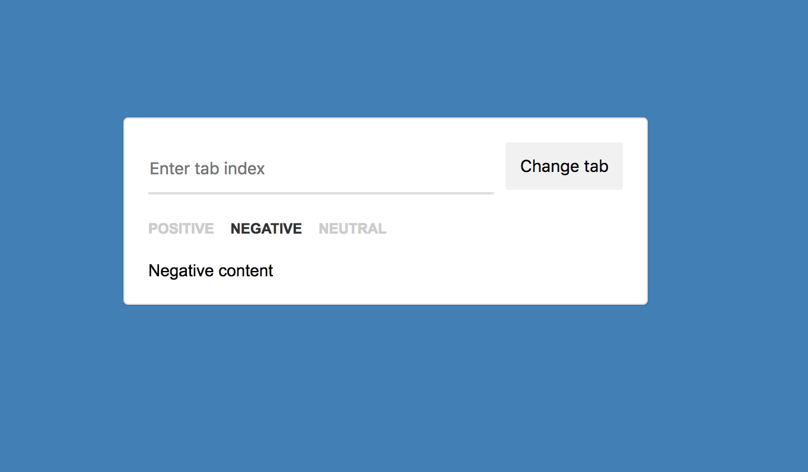

# Elements:  Loop 01 Step 01

## Design Brief
Create a __segmented control__ that turns into a `<select>` for mobile screens. They should sync whenever any of them is changed.

## Design
### Desktop 

### Mobile

